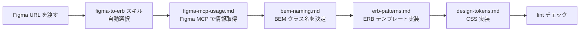

# フロントエンドの<br>AI コーディングの精度を上げる

<div class="abs-br m-6 text-sm opacity-50 text-right">
  小林 和弘<br>
  2026-03-03 
</div>

<!--
タイトルスライド。発表の導入として使う。
-->

---

# アジェンダ

<v-clicks>

1. 課題: AI コーディングの「惜しい」出力
2. `.claude` ディレクトリの設定機能
3. ClinPeer で実際に整備した設定ファイル
4. Before / After の比較
5. 設定ファイル整備のコツ
6. まとめ

</v-clicks>

---

# 1. 課題: AI コーディングの「惜しい」出力

## Claude Code にフロントエンドのコードを書かせると...

<v-clicks class="mt-8">

- CSS のクラス名がプロジェクトの命名規則と合わない
- CSS の色やサイズの値がハードコードで、既存の変数定義を使ってくれない
- セマンティック HTML を使わず `<div>` まみれ
- テストやドキュメントの書き方がプロジェクトのパターンと違う
- 同じリポジトリ内で領域ごとに技術スタックが違うのに、区別してくれない
- Figma から情報を取得するときの手順がバラバラ

</v-clicks>

---
layout: center
---

<p class="text-2xl"><strong class="leading-8">プロジェクト固有の規約を知らない AI は、<br>「動くけど規約に沿わない」コードを書く</strong></p>

<div v-click class="mt-8 text-xl opacity-80">

コードレビューで毎回同じ指摘をすることになる

</div>

<!--
課題の要約。ここが一番伝えたいペイン。
-->

---

# 2. .claude ディレクトリの設定機能

Claude Code は `.claude/` ディレクトリで**プロジェクト固有の知識や指示**を注入できる。

## 2つの公式機能 + 独自の工夫

<div class="mt-4">

| 機能       | 配置先            | 役割                                                       |
| ---------- | ----------------- | ---------------------------------------------------------- |
| **Rules**  | `.claude/rules/`  | 自動で読み込まれるルール。ファイルパスで適用範囲を制御可能 |
| **Skills** | `.claude/skills/` | 特定タスク用の手順書。Claude が自動 or 手動で呼び出す      |

</div>

<div v-click class="mt-4 p-3 bg-blue-50 dark:bg-blue-900/20 rounded-lg">

**+ 独自ディレクトリ**: `.claude/references/` にスキルから参照される詳細な知識ベースを配置

</div>

---

# 2-1. Rules（ルール）

<v-clicks>

- `.claude/rules/` 配下の Markdown を**会話開始時に自動読み込み**
- `paths` のメタ情報で**適用するファイルパスを限定**できる
- CLAUDE.md よりも分野別・機能別に細分化しやすい

</v-clicks>

---

# 2-1. Rules 設定例

<div class="grid grid-cols-2 gap-4">

<div>

## Web 用

```yaml {all|3|5-8}{at:1}
# .claude/rules/frontend/markup-web.md
---
paths: app/views/clin/web/**/*.erb
---
# Web App Markup Guide
- Use the `markup-guide` skill
- Follow custom BEM naming
- Use semantic HTML + custom CSS
```

</div>

<div>

## Admin 用

```yaml {all|3|5-8}{at:1}
# .claude/rules/frontend/markup-admin.md
---
paths: app/views/admin/**/*.erb
---
# Admin Panel Markup Guide
- Do NOT use `markup-guide` skill
- Use DaisyUI + Tailwind CSS
- Avoid custom BEM naming
```

</div>

</div>

<div v-click class="mt-6 p-3 bg-green-50 dark:bg-green-900/20 rounded-lg text-center">

`paths` で適用範囲を指定 → **Web は BEM、Admin は DaisyUI** を Claude が自動判断

</div>

---

# 2-2. Skills（スキル）

<v-clicks>

- `.claude/skills/` 配下に Markdown で定義
- メタデータに `name`, `description` を設定
- `description` に基づき Claude が**自動的に呼び出すか判断**する
- ユーザーが `/<skill_name>` で**明示的に呼び出す**ことも可能
- **段階的ロード**: メタデータだけ先に読み、本文は使用時にロード

</v-clicks>

---

# 2-2. Skills 定義例 — Figma → ERB 変換

```yaml {all|2-5|7-8|10-11|13-14|16-17}{lines:true}
# .claude/skills/figma-to-erb.md
---
name: figma-to-erb
title: Figma → ERB 変換
description: FigmaデザインからClinPeer Web用ERBテンプレートを生成するスキル
---
### 1. Figma情報取得
> **詳細**: `.claude/references/figma-mcp-usage.md` を参照

### 2. BEMクラス名決定
> **詳細**: `.claude/references/bem-naming.md` を参照

### 3. ERBテンプレート実装
> **詳細**: `.claude/references/erb-patterns.md` を参照

### 4. CSS実装
> **詳細**: `.claude/references/design-tokens.md` を参照
```

<div v-click class="mt-4 p-3 bg-green-50 dark:bg-green-900/20 rounded-lg text-center">

`.claude/references/` を参照する構成 → **手順は簡潔に、詳細は必要な時だけロード**

</div>

---

# 2-3. Progressive Disclosure を活かす

## Skills は3段階でロードされる（公式仕様）

| レベル  | ロードタイミング | 内容                                         |
| ------- | ---------------- | -------------------------------------------- |
| Level 1 | 常に             | メタデータ（name, description）のみ |
| Level 2 | スキル発動時     | スキル本文（SKILL.md）                       |
| Level 3 | **必要な時だけ** | スキルから参照される追加ファイル             |

<div v-click class="mt-6 p-4 bg-gray-50 dark:bg-gray-800/50 rounded-lg text-sm italic opacity-80">

"Claude reads only the files needed for each specific task.
The rest remain on the filesystem consuming zero tokens."
— Skills Overview

</div>

---

# 2-3. ClinPeer での実践

この仕組みを活かし、スキルから参照する詳細資料を `.claude/references/` に整理した。

```txt {all|1|2|3|4-7}
.claude/references/
├── bem-naming.md          # BEM命名規則 + フィーチャープレフィックス
├── design-tokens.md       # CSS変数（カラー・スペーシング・タイポグラフィ）
├── erb-patterns.md        # ERBテンプレート実装パターン 8種
├── figma-mcp-usage.md     # Figma MCP ツール使用手順
├── vue-patterns.md        # Vue SFC 実装パターン 8種
├── storybook-patterns.md  # Storybook ストーリー記述パターン
└── vitest-patterns.md     # Vitest テストパターン 11種
```

---

# 3. ClinPeer の設定ファイル全体像

```txt {all|2-7|8-12|13-16|17-19}
.claude/
├── rules/                        # 自動適用されるルール
│   ├── general/code-style.md
│   ├── backend/ruby.md
│   └── frontend/
│       ├── markup-web.md         # Web: BEM + セマンティック HTML
│       ├── markup-admin.md       # Admin: DaisyUI + Tailwind
│       └── css-style.md          # CSS: メディアクエリの書き方
├── skills/                       # タスク実行スキル
│   ├── figma-to-erb.md           # Figma → ERBテンプレート
│   ├── figma-to-vue.md           # Figma → Vue SFC
│   ├── markup-guide.md           # セマンティック HTML ガイド
│   └── pubmed-knowledge.md       # PubMed ドメイン知識
├── references/                   # スキルから参照される知識ベース
│   ├── bem-naming.md
│   └── (7ファイル)
└── commands/                     # ユーザー呼び出し専用コマンド
    └── (3ファイル)
```

---

# 3-1. BEM 命名規則の定義

## .claude/references/bem-naming.md

<div class="grid grid-cols-2 gap-6">

<div>

```txt
Block:    clin-[feature]-[component]
Element:  clin-[feature]-[component]__[element]
Modifier: clin-[feature]-[component]--[modifier]
```

<div v-click class="mt-4">

**ファイルパスからの変換ルール:**

```txt
app/views/clin/web/casebase/questions/show.html.erb
→ clin-casebase-questions-show
```

</div>

</div>

<div v-click>

**フィーチャープレフィックス一覧:**

| プレフィックス   | 用途           |
| ---------------- | -------------- |
| `clin-journal-`  | AI論文         |
| `clin-media-`    | 記事           |
| `clin-casebase-` | 症例検討       |
| `clin-pipeline-` | 新薬カレンダー |
| `clin-search-`   | 検索           |

</div>

</div>

---

# 3-2. デザイントークンの定義

## .claude/references/design-tokens.md

````md magic-move {lines: true}
```css
/* ハードコードされた値 */
.bad-example {
  padding: 16px;
  color: #1a1a1a;
  font-size: 18px;
  font-weight: bold;
}
```

```css
/* CSS変数を使用 */
.good-example {
  padding: var(--Spacing-x4);
  color: var(--Color-Text-Normal);
  font-size: var(--Typo-Size-18);
  font-weight: var(--Weight-Bold);
}
```
````

<div v-click class="mt-4">

**カラー・スペーシング・タイポグラフィ・角丸・メディアクエリ**の全トークンを定義

</div>

---

# 3-3. ERB パターン集

## .claude/references/erb-patterns.md で 8パターンを定義

<div class="grid grid-cols-2 gap-4 mt-4">

<div>

<v-clicks>

1. **リストアイテム** — `<article>` + `link_to`
2. **カード** — 基本、アクション付き
3. **ダイアログ** — Vue 埋め込み、Turbo Frame
4. **フォーム** — 基本、検索フォーム

</v-clicks>

</div>

<div>

<v-clicks>

5. **ナビゲーション** — タブ、パンくず
6. **画像** — 基本、装飾的
7. **空状態** — `empty-state` パターン
8. **ローディング** — `aria-busy` + spinner

</v-clicks>

</div>

</div>

---

# 3-4. Figma → 実装のワークフロー



<div v-click class="mt-6 p-3 bg-green-50 dark:bg-green-900/20 rounded-lg text-center text-lg">

**Figma URL を渡すだけ**で、プロジェクト規約に沿ったコードが出てくる

</div>

---

# 3-4. なぜ ERB と Vue でスキルを分けるのか？

同じ Figma デザインでも、出力先によって規約が根本的に異なる。

| 観点        | figma-to-erb     | figma-to-vue                        |
| ----------- | ---------------- | ----------------------------------- |
| CSS設計     | BEM命名          | `<style scoped>`                    |
| CSSファイル | 別ファイルに分離 | SFC内に同梱                         |
| 成果物      | ERB + CSS        | `.vue` + `.stories.ts` + `.spec.ts` |

<div v-click class="mt-4 p-3 bg-amber-50 dark:bg-amber-900/20 rounded-lg text-sm">

Figma 情報取得の部分は共通（`figma-mcp-usage.md`）だが、
そこから先の実装規約が違うのでスキルを分けている。
**1つに統合すると、スキル内の条件分岐が増えて精度が下がる。**

</div>

---

# 3-4. ERB vs Vue の比較

````md magic-move
```erb
<!-- ERB: BEM プレフィックス付き -->
<article class="clin-journal-list-card">
  <h2 class="clin-journal-list-card__title"><%= title %></h2>
</article>
```

```vue
<!-- Vue: scoped なのでプレフィックス不要 -->
<template>
  <article class="list-card">
    <h2 class="title">{{ title }}</h2>
  </article>
</template>
<style scoped>
.list-card { ... }
</style>
```
````

---

# 4. Before / After

## Before: 設定ファイルなし

<div class="grid grid-cols-2 gap-4">

<div>

```html
<!-- div まみれ、独自クラス名 -->
<div class="card">
  <div class="card-header">
    <span class="category">カテゴリ</span>
  </div>
  <div class="card-body">
    <div class="card-title">タイトル</div>
    <div class="card-date">2024.12.27</div>
  </div>
</div>
```

</div>

<div>

```css
/* ハードコード値 */
.card {
  padding: 16px;
  color: #1a1a1a;
}
.card-title {
  font-size: 18px;
  font-weight: bold;
}
```

</div>

</div>

---

# 4. After: 設定ファイルあり

<div class="grid grid-cols-2 gap-4">

<div>

```erb {all|1|2|3-5|6-8|9-14}
<article class="clin-journal-list-item">
  <%= link_to path, class: "clin-journal-list-card" do %>
    <header class="clin-journal-list-card__header">
      <p class="clin-journal-list-card__category"><%= category %></p>
    </header>
    <div class="clin-journal-list-card__body">
      <h2 class="clin-journal-list-card__title"><%= title %></h2>
    </div>
    <footer class="clin-journal-list-card__footer">
      <time datetime="<%= item.published_at.iso8601 %>">
        <%= item.published_at.strftime("%Y.%m.%d") %>
      </time>
    </footer>
  <% end %>
</article>
```

</div>

<div>

```css
.clin-journal-list-card {
  padding: var(--Spacing-x4);
  color: var(--Color-Text-Normal);
}
.clin-journal-list-card__title {
  font-size: var(--Typo-Size-18);
  font-weight: var(--Weight-Bold);
}
```

<div v-click class="mt-4 text-sm">

**改善ポイント:**

- `<article>`, `<header>`, `<footer>`, `<time>`
- BEM プレフィックス付きクラス名
- CSS 変数によるデザイントークン

</div>

</div>

</div>

---

# 5. 設定ファイル整備のコツ

<div class="grid grid-cols-2 gap-8">

<div>

## 5-1. Rules: 適用範囲を明確に

```yaml
---
paths: app/views/clin/web/**/*.erb
---
```

<v-clicks>

- `paths` で関連ファイル編集時だけ適用
- **真逆のルール**でも衝突しない

</v-clicks>

</div>

<div>

## 5-2. Skills: 詳細は別ファイルへ

```markdown
### 2. BEMクラス名決定

> **詳細**: `.claude/references/bem-naming.md`
```

<v-clicks>

- スキル本文は**全体の流れ**を示す
- 詳細は **Level 3** で必要な時だけロード

</v-clicks>

</div>

</div>

---

# 5. 設定ファイル整備のコツ（続き）

<div class="grid grid-cols-2 gap-8">

<div>

## 5-3. Good / Bad の両方を示す

````md magic-move
```css
/* ハードコードされた値 */
.bad {
  padding: 16px;
  color: #1a1a1a;
}
```

```css
/* CSS変数を使用 */
.good {
  padding: var(--Spacing-x4);
  color: var(--Color-Text-Normal);
}
```
````

<v-click>

**禁止パターン**を明示すると精度が上がる

</v-click>

</div>

<div>

## 5-4. description は具体的に

```yaml {all|2|5}
# 具体的
description: >
  FigmaデザインからClinPeer Web用
  ERBテンプレートを生成するスキル

# 曖昧
description: Figmaの変換をするスキル
```

<v-click>

Claude の自動呼び出し判断に使われるので<br>**何を・どこに・どう出力するか**を明示

</v-click>

</div>

</div>

---

# 5-5. Skills はゼロから書かなくていい

過去の Claude Code セッションを活用した。

<v-clicks>

1. 普段の開発で Claude Code に UI 実装を依頼する
2. レビューで「BEM プレフィックスつけて」「CSS変数使って」と修正指示を出す
3. 指摘が蓄積されたセッションに対して<br>「この会話の修正指示をもとに Skills 化して」と依頼する
4. 出力されたスキルを人間がレビュー・調整する

</v-clicks>

<div v-click class="mt-6 p-4 bg-green-50 dark:bg-green-900/20 rounded-lg text-center text-lg">

**日常のコードレビューが Skills の原材料になる**<br>
<span class="text-sm opacity-80">ゼロから規約ドキュメントを書くより圧倒的に楽</span>

</div>

---

# 6. まとめ

## .claude 設定ファイルで得られたこと

<v-clicks>

1. **命名規則の統一** — BEM プレフィックスが自動で正しくなった
2. **デザイントークンの使用** — ハードコード値がほぼゼロに
3. **セマンティック HTML** — `<div>` まみれから `<article>`, `<time>`, `<nav>` へ
4. **ワークフローの自動化** — Figma URL → 規約準拠コードが一発で出る
5. **領域別ルール** — Web と Admin で適切な技術選択が自動化

</v-clicks>

---
layout: center
---

<div class="text-2xl">

> **AI にプロジェクトの「当たり前」を教えることが最も効果的**

</div>

<div v-click class="mt-8 text-left max-w-md mx-auto">

- CLAUDE.md だけでなく、**Rules / Skills** を活用する
- 「こう書いてほしい」＋「こう書かないでほしい」の**両面**を示す
- 手順はスキルで統合し、詳細は**必要な時だけ**参照させる
- `paths` を使ってルールの**適用範囲を限定**する

</div>

---

# 余談

AI 推進として Claude Code の設定ファイル（Rules / Skills）のフロントエンドコンテキスト整備に取り組みました。

<v-click>

## 目的

**画面実装しかできないフロントエンドエンジニアを一掃したい**

</v-click>

<v-click>

## 結果

- 画面実装は AI コーディングで**ほぼワンショット**で実現可能に
- フロントエンドエンジニアである自分自身がコードを書くことがなくなった
- 今は Rails のコードを書いている

</v-click>

<div v-click class="mt-6 p-4 bg-red-50 dark:bg-red-900/20 rounded-lg text-center text-2xl font-bold">

一掃されたのは自分でした

</div>

---
layout: center
class: text-center
---

# ご清聴ありがとうございました

---

# 参考リンク

- [Agent Skills Overview](https://platform.claude.com/docs/en/agents-and-tools/agent-skills/overview)
- [Skill Authoring Best Practices](https://platform.claude.com/docs/en/agents-and-tools/agent-skills/best-practices)
- [Claude Code - Memory](https://docs.anthropic.com/en/docs/claude-code/memory)
- [ClinPeer Skills 追加 PR](https://github.com/medpeer-dev/clinpeer-rails/pull/6600)
